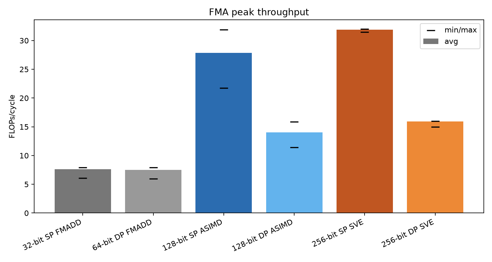
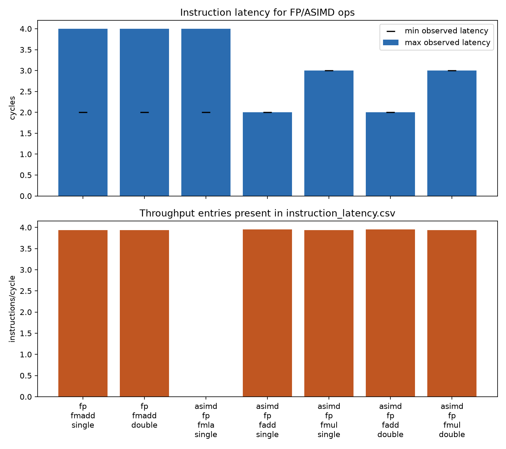
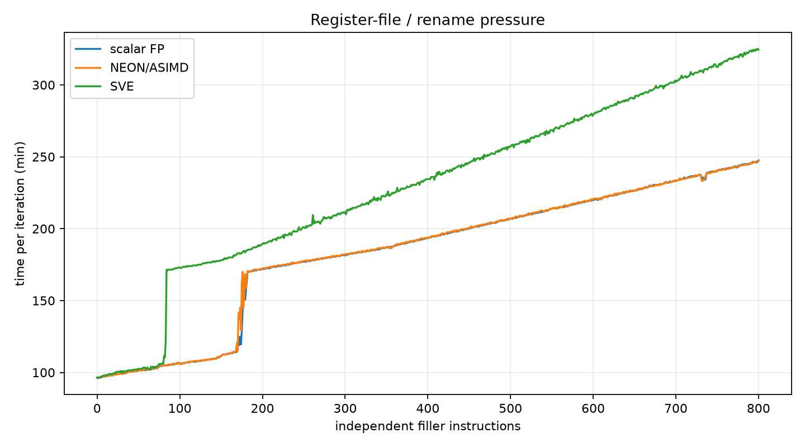
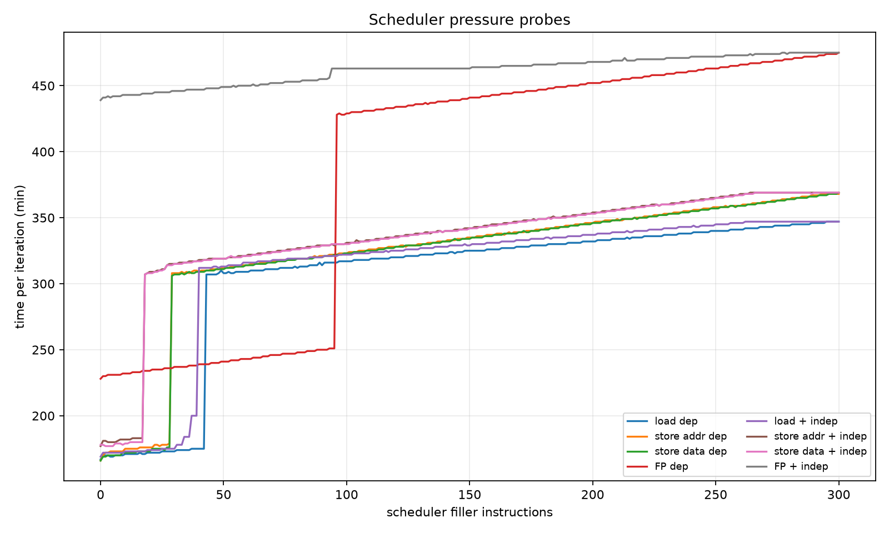
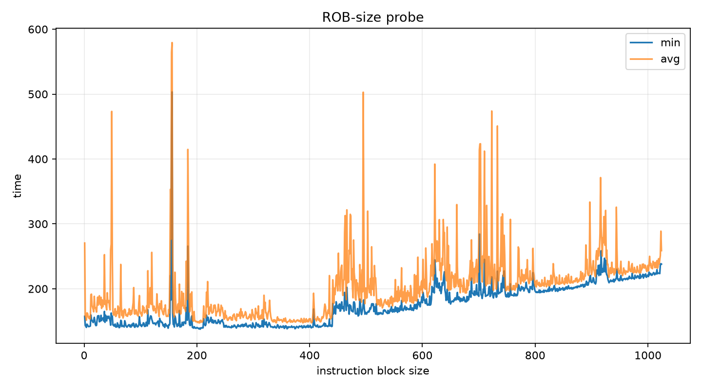
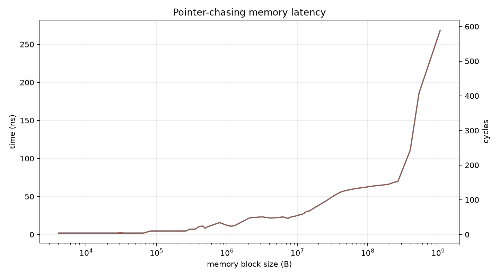
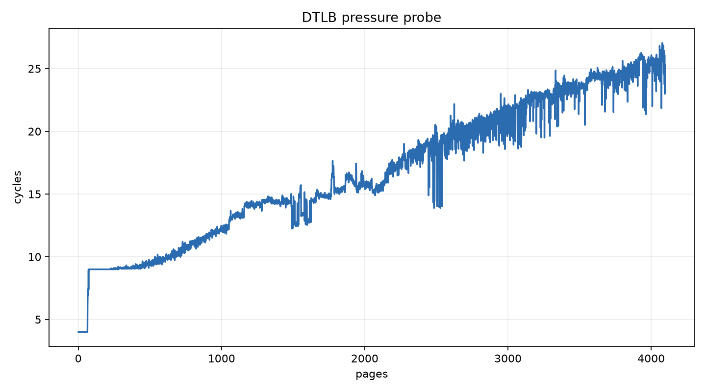
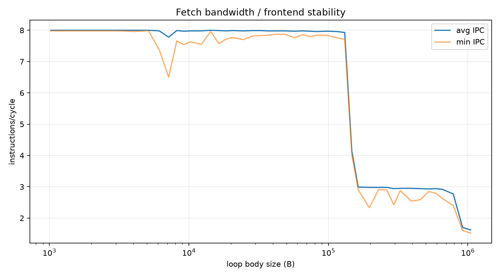

# KP_920C 微架构测试报告

日期：2026-06-25  
机器：AArch64 HiSilicon，192 CPUs，4 个 NUMA 节点，支持 `asimd`、`sve`、`sve2`  
构建：复用现有 `builddir`，release 构建，Meson 选项 `sve=true`

## 测试说明

本次测试关注 KP_920C 平台上的关键微架构参数：FMA 峰值、指令延迟、寄存器压力、调度/乱序窗口、访存延迟、DTLB 和前端取指能力。

所有 benchmark 都从独立目录 `raw/<test>/` 运行，避免仓库里这些程序固定输出 CSV 文件名时互相覆盖。测试按 NUMA 做了适度并行，每个 NUMA 节点分配一个任务，通过 `BIND_CORE_OVERRIDE` 绑核：

- NUMA0：core `4`
- NUMA1：core `52`
- NUMA2：core `100`
- NUMA3：core `148`

构建命令：

```sh
ninja -C builddir fp_peak instruction_latency register_file_size rob_size sched_size memory_latency dtlb_size fetch_bandwidth
```

实际运行命令：

```sh
BIND_CORE_OVERRIDE=4   builddir/fp_peak
BIND_CORE_OVERRIDE=52  builddir/instruction_latency -p
BIND_CORE_OVERRIDE=100 builddir/fetch_bandwidth
BIND_CORE_OVERRIDE=148 builddir/rob_size
BIND_CORE_OVERRIDE=4   builddir/register_file_size
BIND_CORE_OVERRIDE=52  builddir/sched_size
BIND_CORE_OVERRIDE=100 builddir/memory_latency -w 10000 -i 100000 -p
BIND_CORE_OVERRIDE=148 builddir/dtlb_size -f 1 -t 4096 -i 500 -p
```

`memory_latency -f` 和 `dtlb_size -F` 曾先尝试使用更完整的 PMU counter 模式，但当前 HiSilicon 平台缺少仓库里对应的 raw counter mapping（`l2c_misses` / `l1d_misses`），因此最终降级为 cycles-only 的 `-p` 模式。这个限制只影响 miss counter，不影响 cycles 曲线。

## 术语说明：ASIMD 和 NEON

ASIMD 是 AArch64 架构文档和 Linux CPU flags 里常用的名字，全称是 Advanced SIMD。开发和性能调优里常说的 NEON，在 AArch64 上通常就是指这套 128-bit Advanced SIMD/FP 指令集。

本报告里保留 `ASIMD` 这个词，主要是因为 `fp_peak` 输出、`lscpu` flags 和汇编语境都使用 `asimd`/ASIMD；在 KP_920C 的向量计算语境下，报告中的 `128-bit ASIMD FMLA` 可以直接理解为 NEON FMLA。

## 测试点 1：`fp_peak`



`fp_peak` 用大量独立 FMA 指令测浮点峰值吞吐。它是判断 KP_920C 浮点/向量计算上限的第一组数据。

关键结果：

| Pattern | FMLA 指令形式 | 平均 FLOPs/cycle | 每条 FMLA FLOPs | 平均指令吞吐 |
| --- | --- | ---: | ---: | ---: |
| 128-bit SP ASIMD / NEON | `fmla v*.4s, v0.4s, v1.4s` | 27.86 | 8 | 3.48 instr/cycle |
| 256-bit SP SVE | `fmla z*.s, p0/m, z0.s, z1.s` | 31.87 | 16 | 1.99 instr/cycle |
| 128-bit DP ASIMD / NEON | `fmla v*.2d, v0.2d, v1.2d` | 14.02 | 4 | 3.51 instr/cycle |
| 256-bit DP SVE | `fmla z*.d, p0/m, z0.d, z1.d` | 15.95 | 8 | 1.99 instr/cycle |

解读：

- SVE SP/DP FMLA 都只有约 `1.14x` 的 ASIMD 吞吐，而不是 256-bit 相对 128-bit 的理想 `2x`。
- 换算成指令吞吐后，NEON/ASIMD FMLA 约 `3.5 instr/cycle`，SVE FMLA 约 `2.0 instr/cycle`。
- SVE 单条 FMLA 处理的数据更宽，但每周期能执行的 FMLA 指令条数更少，所以最终 FLOPs/cycle 只小幅领先。
- 在这台机器上，SVE 可用但不能直接假设向量计算吞吐会翻倍；NEON 和 SVE 路径都需要实测。
- 估算 KP_920C 浮点计算上限时，应以实测 FMA 峰值作为 roofline 上限，而不是只按向量宽度推导。

原始数据：`raw/fp_peak/fp_peak.csv`

## 测试点 2：`instruction_latency`



`instruction_latency` 测常用整数、标量 FP 和 ASIMD 指令的延迟/吞吐。对计算密集型向量循环来说，最关心的是 FMA、FADD、FMUL 的延迟链，因为它决定需要多少独立累加链才能填满流水。

关键结果：

| 指令组 | 延迟 | 吞吐项 |
| --- | ---: | ---: |
| `asimd_fp_fmla_single` | 2.00/4.00 cycles | 当前 pattern 未单独测吞吐 |
| `asimd_fp_fadd_single` | 2.00 cycles | 3.95 instr/cycle |
| `asimd_fp_fmul_single` | 3.00 cycles | 3.94 instr/cycle |
| scalar `fmadd` SP/DP | 2.00/4.00 cycles | 3.94 instr/cycle |

解读：

- 当前仓库的 ASIMD FMLA 有 latency pattern，但缺少独立的 ASIMD FMLA throughput pattern。
- 因此 FMA 吞吐应该主要参考 `fp_peak`，FMLA 依赖链长度参考这里的 2/4 cycle 延迟结果。
- 下一步如果要继续精调向量 FMA 热循环，应补 `fmla vD.4s, vN.4s, vM.s[lane]` 和 load-to-use spacing 测试。

原始数据：`raw/instruction_latency/instruction_latency.csv`

## 测试点 3：`register_file_size`



`register_file_size` 用不同数量的独立 filler 指令探测 rename/register-file 压力。向量热循环中的 accumulator 数量、unroll 深度和临时寄存器数量都会直接受这个限制影响。

关键结果：

| Pattern | 基线 min | 首次超过基线 +50 的 size | size=800 时 min |
| --- | ---: | ---: | ---: |
| scalar FP | 96.50 | 177 | 247.50 |
| NEON/ASIMD | 96.50 | 175 | 247.00 |
| SVE | 96.50 | 84 | 324.50 |

解读：

- SVE 压力曲线明显更早抬升，说明更宽的 Z 寄存器路径对 rename/register-file 资源更敏感。
- 大 SVE unroll 不一定比 NEON 更划算，尤其是在 accumulator 很多、同时还要保留加载数据和临时变量时。
- 对 NEON/ASIMD 路径，可以先考虑中等 accumulator 数量；对 SVE 路径，要更谨慎控制活跃寄存器数量和 unroll。

原始数据：`raw/register_file_size/register_file_size.csv`

## 测试点 4：`sched_size`



`sched_size` 用 load、store address、store data、FP 等 pattern 探测 scheduler 压力。它帮助判断热循环里 load/FMA/store 混排时，哪类指令更可能成为调度瓶颈。

关键结果：

| Pattern | 起始 min | size=300 时 min |
| --- | ---: | ---: |
| dependent load | 167.00 | 347.00 |
| dependent store address | 166.00 | 368.00 |
| dependent store data | 166.00 | 369.00 |
| dependent FP | 228.00 | 475.00 |
| load + independent | 169.00 | 347.00 |
| FP + independent | 439.00 | 475.00 |

解读：

- FP pattern 本身起点更高，说明长延迟 FP 链和调度资源压力对循环编排很敏感。
- 热循环里应保持 FMA、load、store 的交错，避免短距离 load-to-use 和单一资源堆积。
- 这个测试是压力探针，不直接给出“最佳 tile”，但能提示哪些 unroll 方案可能更容易卡 scheduler。

原始数据：`raw/sched_size/sched_size.csv`

## 测试点 5：`rob_size`



`rob_size` 用 pointer-chasing 长延迟链和不同大小的独立指令块探测乱序窗口能力。它反映处理器能否靠独立 FMA/load 隐藏部分访存或指令延迟。

关键结果：

| 指标 | 值 |
| --- | ---: |
| size=1 min | 157.53 |
| 首次超过基线 +20 的 size | 153 |
| size=1024 min | 237.98 |

解读：

- 曲线在约百级指令块后明显上升，说明乱序窗口能隐藏一定延迟，但不是无限制。
- 适度 unroll 可以帮助隐藏 load/FMA 延迟，但过大 unroll 会增加 ROB、I-cache 和调度压力。
- 实际热循环需要在“足够 ILP”和“代码体积/资源压力”之间平衡。

原始数据：`raw/rob_size/rob_size.csv`

## 测试点 6：`memory_latency`



`memory_latency` 是 pointer-chasing 延迟测试，用来观察不同工作集规模下的 load 延迟。它不是带宽测试，但对判断 KP_920C cache/内存层级边界有参考价值。

关键结果：

| 工作集 | cycles/access |
| --- | ---: |
| 4 KiB | 4.00 |
| 80 KiB | 10.00 |
| 1 GiB | 589.07 |

解读：

- 小工作集接近 L1 命中延迟，约 4 cycles。
- 工作集进入更大层级后延迟逐步升高，1 GiB pointer chasing 已接近 589 cycles。
- 对计算密集型程序，应通过数据布局和分块尽量让热数据停留在 cache 内；这个测试不能替代带宽测试，后续可补 sequential read/write/copy 带宽。

原始数据：`raw/memory_latency/memory_latency.csv`

## 测试点 7：`dtlb_size`



`dtlb_size` 扫 1 到 4096 页的 pointer-chasing 延迟，用来观察页表/TLB 压力。大工作集、连续 buffer 和多线程 NUMA 分配都会受 TLB 行为影响。

关键结果：

| 页数 | cycles/access |
| --- | ---: |
| 1 | 4.00 |
| 4096 | 25.30 |

解读：

- cycles-only 模式下，4096 页时访问成本仍远低于主存 pointer chasing 尾部，但明显高于 1 页。
- 由于缺少 raw miss counter mapping，本报告没有 `l1dtlb/l2dtlb` miss 数据，不能精确拆分 TLB 层级。
- 后续若要研究超大工作集或多 NUMA buffer，应补平台 PMU mapping 或使用外部 perf 事件重新采集。

原始数据：`raw/dtlb_size/dtlb_size.csv`

## 测试点 8：`fetch_bandwidth`



`fetch_bandwidth` 用不同代码体积的循环测前端取指/解码稳定性。大规模 unroll、多个热路径变体和 inline assembly 都可能把压力转移到前端。

关键结果：

| loop body size | avg IPC |
| --- | ---: |
| 1 KiB | 8.00 |
| 1 MiB | 1.62 |

解读：

- 小 loop body 下 IPC 约 8，前端供应充足。
- 代码体积扩大到 1 MiB 时 avg IPC 降到 1.62，说明大代码体积会显著伤害前端。
- 热循环不应盲目扩大 unroll 或生成过多热路径变体；需要把 I-cache/frontend 成本纳入评估。

原始数据：`raw/fetch_bandwidth/fetch_bandwidth.csv`

## 结论

- KP_920C 支持 SVE/SVE2，但 `fp_peak` 显示 SVE FMLA 只比 ASIMD 高约 `1.14x`，不应按 2 倍峰值规划向量计算性能目标。
- SVE 的 register-pressure 曲线更早变差，说明更宽向量并不免费；SVE 路径需要更谨慎控制活跃寄存器数量和 unroll 策略。
- 下一步最值得补的是更贴近真实热循环的专项 benchmark：lane-form FMLA、load-to-use spacing、不同 unroll 深度和连续读写/拷贝带宽。
- 本报告是 KP_920C 微架构探针，不是端到端应用 benchmark。最终仍需要结合实际负载做性能回归。

## 测试点汇总

| 测试点 | 关注问题 | 关键结果 | 调优启示 |
| --- | --- | --- | --- |
| `fp_peak` | NEON/SVE FMLA 峰值 | NEON FMLA 约 `3.5 instr/cycle`；SVE FMLA 约 `2.0 instr/cycle`；SVE/ASIMD FLOPs/cycle 约 `1.14x` | SVE 不应按理想 2 倍估算，需要按实际负载实测 |
| `instruction_latency` | FMA/FADD/FMUL 延迟链 | ASIMD FMLA latency 为 `2.00/4.00 cycles` | 独立累加链数量要足够隐藏 FMLA 延迟 |
| `register_file_size` | rename/register-file 压力 | SVE 在 size `84` 已超过基线 +50；NEON 约 `175` | SVE 活跃寄存器和 unroll 更容易受寄存器资源限制 |
| `sched_size` | load/store/FP scheduler 压力 | dependent FP 从 `228.00` 增至 `475.00` | 需要混排 load/FMA/store，避免单类资源堆积 |
| `rob_size` | 乱序窗口可隐藏多少延迟 | 约 size `153` 后超过基线 +20 | unroll 有收益但不能无限放大 |
| `memory_latency` | cache/内存层级延迟 | 4 KiB 为 `4.00 cycles`，1 GiB 为 `589.07 cycles` | 数据分块要尽量保持热数据在 cache 内 |
| `dtlb_size` | 页数扩展后的 TLB 压力 | 1 页 `4.00 cycles`，4096 页 `25.30 cycles` | 大工作集和连续 buffer 需关注 TLB，但本次无 miss counter |
| `fetch_bandwidth` | 大代码体积下前端能力 | 1 KiB avg IPC `8.00`，1 MiB avg IPC `1.62` | 过度 unroll 或过多热路径变体会伤前端 |

## 文件索引

- 原始 CSV：`raw/*/*.csv`
- 图表：`plots/*.png`
- 绘图脚本：`plot_report.py`
- 环境记录：`system.txt`
- 自动摘要：`summary_metrics.md`
